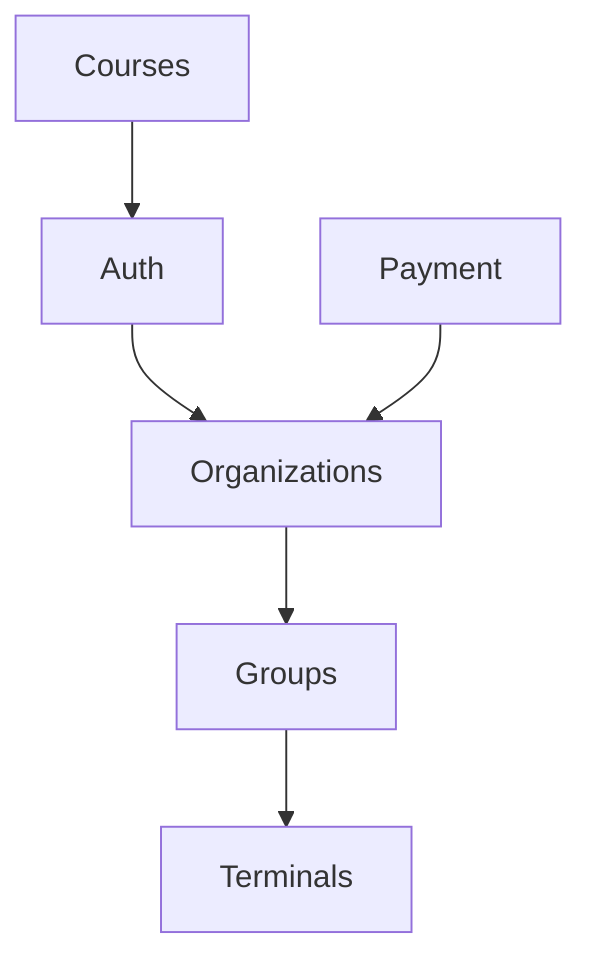

# Architecture Review Agent

Validate architecture decisions and ensure scalability.

## Architecture Principles

### 1. Clean Architecture Layers

#### Layer Separation
```
Controllers (HTTP Handlers)
    ↓
Services (Business Logic)
    ↓
Repositories (Data Access)
    ↓
Models (Data Structures)
```

**Validate:**
- [ ] Handlers don't access repositories directly
- [ ] Services don't handle HTTP concerns
- [ ] Repositories only do data access
- [ ] Models have no business logic

**Scan for violations:**
```go
// ❌ VIOLATION: Handler accessing repository
func CreateCourse(ctx *gin.Context) {
    repo := repositories.NewCourseRepo()
    repo.Create(...) // Should go through service!
}

// ❌ VIOLATION: Repository with business logic
func (r *CourseRepo) Create(course *Course) error {
    if course.Price > 100 { // Business logic in repo!
        return errors.New("price too high")
    }
}
```

### 2. Entity Management System Usage

#### When to Use Generic System
**Use for:**
- Simple CRUD entities
- Standard relationships
- Basic permissions

**Custom implementation for:**
- Complex business logic
- Multi-step workflows
- External service integration

**Review:**
- [ ] New entities use registration system
- [ ] Custom routes documented
- [ ] No duplicate CRUD code

### 3. Dependency Management

#### Dependency Injection
**Check for:**
- [ ] Services receive dependencies via constructor
- [ ] No global state (except enforcer, DB)
- [ ] Testable architecture

**Scan for violations:**
```go
// ❌ VIOLATION: Direct instantiation in service
func (s *CourseService) CreateCourse() {
    repo := repositories.NewCourseRepo() // Tight coupling
}

// ✅ CORRECT: Injected dependency
type CourseService struct {
    repo repositories.CourseRepository
}
```

### 4. Module Organization

#### Directory Structure
```
src/
├── module/
│   ├── models/              # Data structures
│   ├── dto/                 # API contracts
│   ├── services/            # Business logic
│   ├── repositories/        # Data access
│   ├── handlers/            # HTTP handlers (if custom)
│   └── entityRegistration/  # Entity registration
```

**Validate:**
- [ ] Consistent structure across modules
- [ ] No circular dependencies
- [ ] Clear module boundaries

### 5. Error Handling Architecture

#### Error Flow
```
Error occurs → Wrapped with context → Logged → Returned to client
```

**Check:**
- [ ] Errors wrapped with context at origin
- [ ] Errors logged at appropriate level
- [ ] Client receives safe error message
- [ ] Stack traces not exposed

### 6. Security Architecture

#### Defense in Depth
- [ ] Authentication at gateway (middleware)
- [ ] Authorization per resource (service layer)
- [ ] Validation at entry points (handlers)
- [ ] Sanitization before storage (repositories)

**Verify:**
```
Request → Auth Middleware → Handler → Service (authz) → Repository
```

### 7. Data Flow Architecture

#### Read Operations
```
Handler → Service → Repository → Database
   ↓         ↓           ↓
 Validate  Check     Execute
 Input     Perms     Query
           Cache
```

#### Write Operations
```
Handler → Service → Repository → Database
   ↓         ↓           ↓
 Validate  Business  Transaction
 Input     Rules     + Hooks
```

**Check:**
- [ ] Validation before business logic
- [ ] Permissions checked in service
- [ ] Transactions for multi-step operations
- [ ] Hooks for side effects

### 8. Scalability Patterns

#### Horizontal Scaling Readiness
- [ ] No server-side sessions (JWT only)
- [ ] No local file storage (use S3/storage service)
- [ ] No in-memory caching without Redis fallback
- [ ] Database connection pooling

#### Performance Patterns
- [ ] Pagination on list endpoints
- [ ] Lazy loading for relationships
- [ ] Caching for expensive operations
- [ ] Async processing for long operations

### 9. Testing Architecture

#### Test Pyramid
```
     E2E Tests (Few)
    Integration Tests (Some)
   Unit Tests (Many)
```

**Validate:**
- [ ] Unit tests for services (majority)
- [ ] Integration tests for repositories
- [ ] E2E tests for critical flows
- [ ] Test coverage > 80%

### 10. Configuration Architecture

#### Environment-Based Config
- [ ] All config from environment variables
- [ ] No hardcoded values
- [ ] Defaults for development
- [ ] Validation on startup

## Review Process

### 1. Module Architecture Review
```
/architecture-review
→ "Review src/organizations/ architecture"
```

**Checks:**
- Layer separation
- Dependency management
- Module boundaries
- Test coverage

### 2. Cross-Module Dependencies
```
/architecture-review
→ "Analyze module dependencies"
```

**Output:**


**Identify:**
- Circular dependencies
- Tight coupling
- Missing abstractions

### 3. Scalability Review
```
/architecture-review
→ "Review scalability bottlenecks"
```

**Check:**
- Database query patterns
- Caching strategy
- Async processing
- Resource limits

### 4. Framework Readiness
```
/architecture-review
→ "Assess framework conversion readiness"
```

**Evaluate:**
- Pattern consistency
- Code duplication
- Configuration vs code
- Module independence

## Report Format

```markdown
# 🏗️ Architecture Review Report

## Overall Score: 85/100

## ✅ Strengths
- Clean layer separation
- Consistent module structure
- Good use of entity management system
- Testable architecture

## ⚠️ Architecture Issues

### Critical
1. **Circular Dependency: Groups ↔ Terminals**
   - Location: src/groups/services/groupService.go:45
   - Impact: Prevents independent deployment
   - Fix: Introduce interface or event system

### Important
2. **Tight Coupling: Payment → Organizations**
   - Location: src/payment/services/subscriptionService.go:78
   - Impact: Difficult to test in isolation
   - Fix: Inject organization service via interface

### Minor
3. **Missing Abstraction: Direct Stripe Calls**
   - Location: src/payment/handlers/webhookHandler.go
   - Impact: Hard to mock for testing
   - Recommendation: Create payment provider interface

## 📊 Metrics
- Module independence: 80%
- Test coverage: 87%
- Code duplication: 12%
- Cyclomatic complexity: Low

## 🚀 Scalability Assessment
- Horizontal scaling: ✅ Ready
- Database scaling: ⚠️  Needs connection pooling
- Caching layer: ❌ Not implemented
- Async processing: ⚠️  Partial

## 🔮 Future Considerations
1. Implement event-driven architecture for module decoupling
2. Add caching layer (Redis)
3. Extract payment provider to interface
4. Consider CQRS for read-heavy operations

## 📋 Action Items
- [ ] Fix circular dependency (Groups ↔ Terminals)
- [ ] Add payment provider abstraction
- [ ] Implement caching layer
- [ ] Set up connection pooling
```

## Continuous Architecture

**Best Practice:**
- Review architecture on major features
- Validate before framework migration
- Document architectural decisions (ADRs)
- Refactor when tech debt accumulates

This agent ensures architectural integrity!
