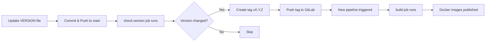

# CI/CD Pipeline Documentation

This document describes the OCF Core CI/CD pipeline workflow, configuration, and best practices.

## Quick Reference

**Need to create a new release?**
```bash
echo "0.2.0" > VERSION
git add VERSION
git commit -m "Bump version to 0.2.0"
git push origin main
# → CI automatically creates tag v0.2.0 and builds Docker images
```

**Need to run tests?**
- Open a merge request, or
- Click "Run Pipeline" in GitLab UI

**Check current version:**
```bash
curl http://localhost:8080/api/v1/version
```

---

## Table of Contents

- [Overview](#overview)
- [Pipeline Stages](#pipeline-stages)
- [Automated Versioning & Releases](#automated-versioning--releases)
- [Test Execution](#test-execution)
- [Docker Image Building](#docker-image-building)
- [Configuration](#configuration)
- [Workflows](#workflows)

## Overview

The OCF Core CI/CD pipeline is designed to:

- ✅ Automatically detect version changes and create release tags
- ✅ Run tests only when necessary (on merge requests or manual trigger)
- ✅ Build Docker images only for tagged releases
- ✅ Create both versioned and `latest` Docker images
- ✅ Minimize CI execution time for regular commits

## Pipeline Stages

The pipeline consists of three stages:

```
check → test → build
```

### 1. Check Stage

**Job: `check:version`**

- **Runs on**: `main` branch only
- **Purpose**: Detect version changes and automatically create git tags
- **What it does**:
  1. Reads current version from `VERSION` file
  2. Compares with latest git tag
  3. If version changed, creates and pushes new tag (format: `vX.Y.Z`)
  4. Triggers a new pipeline for the tag

### 2. Test Stage

**Jobs:**
- `test:entity-management` - Entity management tests with PostgreSQL
- `test:courses` - Course-related tests
- `test:quick` - Quick validation tests (SQLite only)
- `test:race` - Race condition detection tests
- `test:auth` - Authentication tests with Casdoor

**Runs on**:
- ✅ Merge requests
- ✅ Manual pipeline triggers (via GitLab UI)
- ❌ **NOT** on regular commits to main/develop

**Why**: Saves CI time by running tests only when needed for code review or validation.

### 3. Build Stage

**Job: `build`**

- **Runs on**: Version tags only (`v*` pattern)
- **Purpose**: Build and publish Docker images
- **Output**: Two Docker images:
  - `registry/ocf-core:<version>` (e.g., `0.2.0`)
  - `registry/ocf-core:latest`

## Automated Versioning & Releases

### How It Works

OCF uses a **`VERSION` file** as the single source of truth for versioning.

```
VERSION
├── Contains just the version number (e.g., "0.1.0")
├── Committed to git
└── Read by application and CI/CD
```

### Version Management Flow



### Creating a New Release

**Step 1**: Update the VERSION file

```bash
echo "0.2.0" > VERSION
git add VERSION
git commit -m "Bump version to 0.2.0"
git push origin main
```

**Step 2**: CI automatically handles the rest

- `check:version` job detects the change
- Creates and pushes tag `v0.2.0`
- A new pipeline is triggered for the tag
- `build` job runs and publishes Docker images

**Result**: Two Docker images are created:
- `your-registry/ocf-core:0.2.0`
- `your-registry/ocf-core:latest`

## Test Execution

### Running Tests Automatically

Tests run automatically on:

**1. Merge Requests**
```bash
# Create a merge request → tests run automatically
git checkout -b feature/my-feature
git push origin feature/my-feature
# Open MR in GitLab → CI runs all tests
```

**2. Manual Trigger**
- Go to **CI/CD → Pipelines** in GitLab
- Click **"Run Pipeline"**
- Select branch
- All tests will run

### Running Tests Locally

```bash
# Entity management tests
make test-entity-manager

# All tests
make test

# With coverage
make coverage

# Quick tests only
go test -short ./tests/entityManagement/...

# Auth tests (requires Casdoor)
docker-compose -f docker-compose.test.yml up -d
go test -v ./tests/auth/...
```

### Test Types

| Test Job | Duration | Database | Purpose |
|----------|----------|----------|---------|
| `test:entity-management` | ~2-3 min | PostgreSQL + SQLite | Full entity CRUD tests |
| `test:courses` | ~1 min | None | Course logic tests |
| `test:quick` | ~30s | SQLite | Quick validation |
| `test:race` | ~3-4 min | PostgreSQL | Race condition detection |
| `test:auth` | ~2 min | PostgreSQL + Casdoor | Authentication flow tests |

## Docker Image Building

### Build Triggers

Builds are triggered **ONLY** when a version tag is created:

```bash
# These DO NOT trigger builds:
git push origin main
git push origin develop
git push origin feature/xyz

# These DO trigger builds:
git tag v0.2.0
git push origin v0.2.0
# OR: Version change in VERSION file (auto-tagged by CI)
```

### Image Tags

Every build creates two Docker images:

```bash
# Version-specific tag
your-registry/ocf-core:0.2.0

# Latest tag (always points to newest version)
your-registry/ocf-core:latest
```

### Using Docker Images

**Production** (pinned version):
```yaml
# docker-compose.yml
services:
  ocf-core:
    image: registry.gitlab.com/your-org/ocf-core:0.2.0
```

**Development** (always latest):
```yaml
# docker-compose.yml
services:
  ocf-core:
    image: registry.gitlab.com/your-org/ocf-core:latest
```

## Configuration

### Required GitLab Settings

**Option 1: Enable CI_JOB_TOKEN push (Recommended)**

For GitLab 16.0+:
1. Go to **Settings → CI/CD → Job token permissions**
2. Enable **"Allow CI job tokens to push to this project's repository"**

For GitLab 15.9-16.0:
1. Go to **Settings → Repository → Protected tags**
2. Pattern: `v*`
3. Allowed to create: `Maintainers + Developers`

**Option 2: Use Project Access Token**

1. **Settings → Access Tokens → Add new token**
   - Name: `CI_PUSH_TOKEN`
   - Role: `Maintainer`
   - Scopes: `write_repository`

2. **Settings → CI/CD → Variables → Add variable**
   - Key: `CI_PUSH_TOKEN`
   - Value: (token from step 1)
   - Protected: ✓
   - Masked: ✓

### GitLab CI Variables

Required variables (set in **Settings → CI/CD → Variables**):

| Variable | Description | Example | Required |
|----------|-------------|---------|----------|
| `token_jwt_key` | Production JWT certificate (base64) | `LS0tLS1CRUd...` | Yes |
| `token_jwt_key_test` | Test JWT certificate (base64) | `LS0tLS1CRUd...` | Yes (for auth tests) |
| `CI_PUSH_TOKEN` | Token for pushing tags | `glpat-xxx...` | Optional (if CI_JOB_TOKEN enabled) |

## Workflows

### Development Workflow

```bash
# 1. Create feature branch
git checkout -b feature/my-feature

# 2. Make changes & commit
git add .
git commit -m "Add new feature"
git push origin feature/my-feature

# 3. Create MR in GitLab
# → Tests run automatically

# 4. After approval, merge to main
# → No tests run (fast!)
# → Only check:version runs
```

### Release Workflow

```bash
# 1. Update version
echo "1.0.0" > VERSION

# 2. Commit version change
git add VERSION
git commit -m "Release v1.0.0"
git push origin main

# 3. CI automatically:
#    - Creates tag v1.0.0
#    - Triggers new pipeline
#    - Builds Docker images:
#      → ocf-core:1.0.0
#      → ocf-core:latest

# 4. Deploy using version tag
docker pull registry.gitlab.com/your-org/ocf-core:1.0.0
```

### Hotfix Workflow

```bash
# 1. Create hotfix branch from tag
git checkout -b hotfix/1.0.1 v1.0.0

# 2. Fix the issue
git commit -am "Fix critical bug"

# 3. Update version
echo "1.0.1" > VERSION
git add VERSION
git commit -m "Bump to v1.0.1"

# 4. Merge to main
git checkout main
git merge hotfix/1.0.1
git push origin main

# 5. CI creates v1.0.1 tag and builds
```

### Manual Test Trigger

To run tests on any branch without creating an MR:

1. Go to **CI/CD → Pipelines**
2. Click **"Run Pipeline"**
3. Select your branch
4. Click **"Run Pipeline"**
5. All tests will execute

## Version API Endpoint

Check the current running version:

```bash
curl http://localhost:8080/api/v1/version
```

Response:
```json
{
  "version": "0.1.0"
}
```

This endpoint:
- ✅ No authentication required
- ✅ Reads from `VERSION` file (or `OCF_VERSION` env var as fallback)
- ✅ Documented in Swagger at `/swagger/index.html`

## Troubleshooting

### Tag creation fails

**Error**: `fatal: could not create tag`

**Solution**: Check CI_JOB_TOKEN permissions or create CI_PUSH_TOKEN (see [Configuration](#configuration))

### Build doesn't trigger after tag creation

**Cause**: Tag was created via API in same pipeline

**Solution**: The pipeline uses `git push` now, which triggers a new pipeline. Ensure token has push permissions.

### Tests fail with "Application not found"

**Cause**: Missing `token_jwt_key_test` variable

**Solution**: Add the test JWT certificate to CI/CD variables

### Version not detected

**Error**: `ℹ️ Version unchanged`

**Cause**: VERSION file content matches the latest tag

**Solution**: Ensure VERSION file contains a different version number than the latest tag

## Best Practices

### 1. Semantic Versioning

Follow [SemVer](https://semver.org/):

- **MAJOR** (1.0.0): Breaking changes
- **MINOR** (0.2.0): New features, backward compatible
- **PATCH** (0.1.1): Bug fixes

### 2. Version File

- ✅ **DO**: Keep it simple - just the version number
- ✅ **DO**: Commit it to git
- ❌ **DON'T**: Add comments or extra text
- ❌ **DON'T**: Include 'v' prefix

```bash
# Good
0.2.0

# Bad
v0.2.0
Version: 0.2.0
```

### 3. Testing

- ✅ **DO**: Run tests locally before pushing
- ✅ **DO**: Create MRs for code review
- ✅ **DO**: Use manual triggers for experimental branches
- ❌ **DON'T**: Rely only on CI for testing

### 4. Releases

- ✅ **DO**: Update VERSION file in a dedicated commit
- ✅ **DO**: Use descriptive commit messages ("Bump version to 1.0.0")
- ✅ **DO**: Wait for build to complete before deploying
- ❌ **DON'T**: Skip version numbers
- ❌ **DON'T**: Reuse version numbers

## Support

For issues or questions about the CI/CD pipeline:

1. Check this documentation
2. Review the `.gitlab-ci.yml` file
3. Check pipeline logs in GitLab
4. Contact the development team
