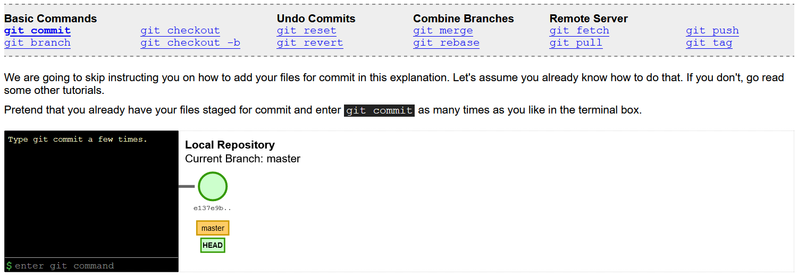
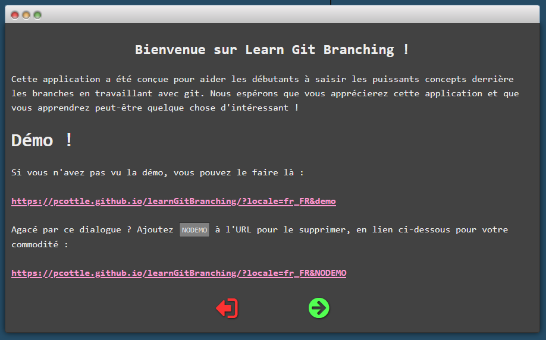

title:GIT - TP - Jeux
intro:nous permettra de manipuler les concepts vus en cours à l'aide de jeux.
conclusion:Fait le tour des fonctionnalités de base de git grâce à des jeux !

---

## Testons et observons

https://onlywei.github.io/explain-git-with-d3/

---

<!-- _class: hide-footer -->
## Learn Git Branching

https://learngitbranching.js.org

---

## Oh My Git

https://ohmygit.org/

