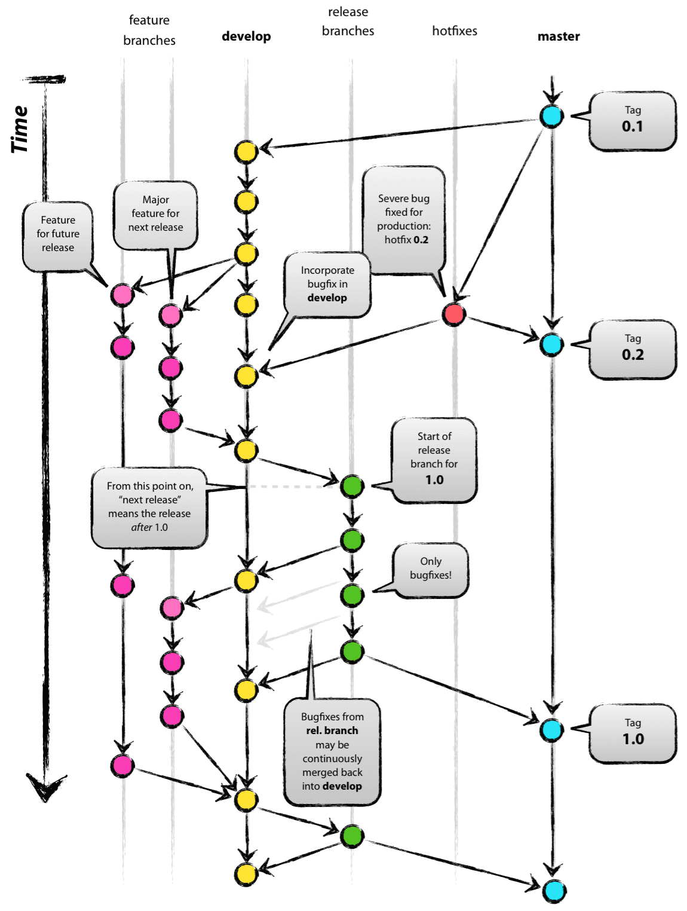
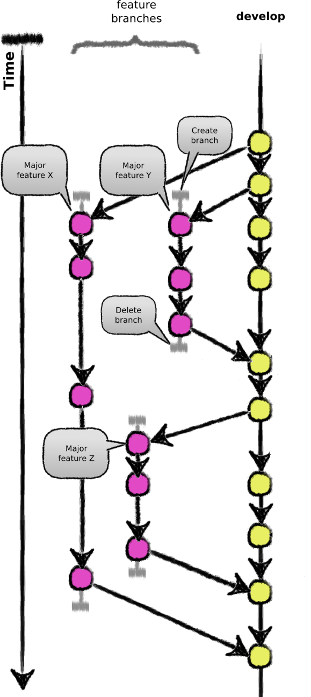
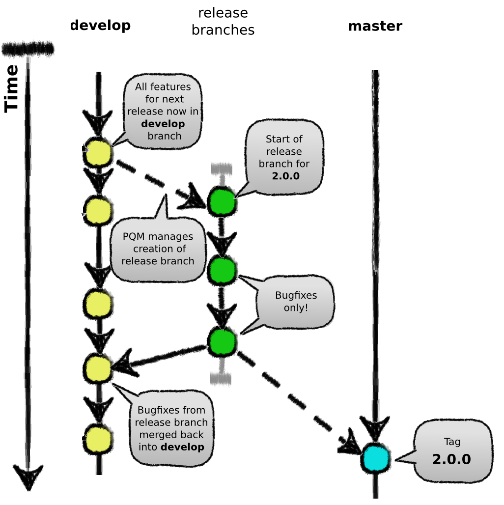
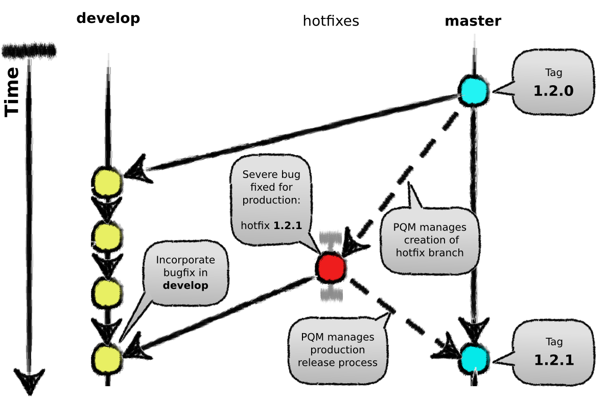

title:Les modèles de branches
intro:nous présentera les branches et un modèle pour les utiliser.
conclusion:Découvert le concept de branches et de modèle de branches.

---




---

## Un modèle de branches efficace

- main (anciennement master)
- develop

**origin/main** (nom alternatif : master) est la branche principale où le code source de HEAD reflète l'état prêt à être déployé **en production**

**origin/develop** (noms alternatifs : staging / intégration) est la branche où le code source de HEAD reflète les derniers changements livrés **pour la prochaine version**. C'est à partir de cet emplacement que sont compilées les versions quotidiennes.

---

## Un modèle de branches efficace

Les branches de support :

- les branches pour les **fonctionnalités**
- les branches pour les **versions**
- les branches de **correctifs**

Contrairement aux branches principales, ces branches ont toujours une durée de vie limitée, puisqu'elles seront **effacées** à terme.

---

### Les branches de fonctionnalité

Peuvent provenir de :

- develop
- une autre branche feature

Doivent être fusionnées dans :

- develop

Convention de nommage  :

- feat-




---

### Les branches de fonctionnalité

```bash
$ git checkout -b feat-myFeature develop

# Développement de la fonctionnalité (commits)

$ git checkout develop
$ git pull origin develop
$ git merge feat-myFeature

# Résolution d'éventuels conflits

$ git push origin develop
$ git branch -d feat-myFeature
```

---

### Les branches de livraison

Peuvent provenir de :
- develop

Doivent être fusionnées dans :
- develop
- main (master)

Convention de nommage de la branche :
- release-




---

### Les branches de livraison

```shell
$ git checkout -b release-v1.2 develop

# Mise à jour des scripts/documentation (commits)
$ git checkout main
$ git merge release-v1.2
$ git tag v1.2
$ git push origin main --tags

$ git checkout develop
$ git pull develop
$ git merge release-v1.2
$ git push origin develop

$ git branch -d release-v1.2
```

---

### Les branches de correctifs

Peuvent provenir de :

- main (master)

Doivent être fusionnées dans :

- develop
- main (master)

Convention de nommage de la branche :

- hotfix-




---

### Les branches de correctifs

```shell
$ git checkout -b hotfix-v1.2.1 main

# Correction de l'anomalie + mise à jour des scripts/documentation (commits)

$ git checkout main
$ git merge hotfix-v1.2.1
$ git tag v1.2.1
$ git push --tags origin main
$ git checkout develop
$ git merge hotfix-v1.2.1
$ git push --tags origin develop
$ git branch -d hotfix-v1.2.1
```

---

### Les commandes principales

- Créer une branche locale :

```shell
git branch <newBranch>
```

- Charger la branche dans le workspace :

```shell
git checkout <maBranch>
git switch <maBranch>
```

- Merger 2 branches :

```shell
git merge <otherBranch>
```

---

### Les commandes principales

- Lister les branches locales :

```shell
git branch
```

- Supprimer une branche :

```shell
git branch -d <oldBranch>
```
