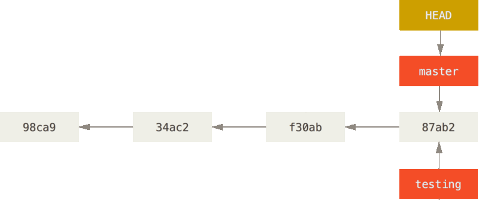

title:Les branches, des pointeurs
intro:nous expliquera comment fonctionnent les branches.
conclusion:Découvert que les branches ne sont que des pointeurs.

---

### HEAD, tête de lecture


---

```shell
$ git branch testing
```


---

```shell
$ git checkout testing
```


---

```shell
$ vim fichier #ici on fait des changements
$ git commit -m 'changements dans le fichier !'
```


---

```shell
$ git checkout master
```


---

```shell
$ git merge testing
```


