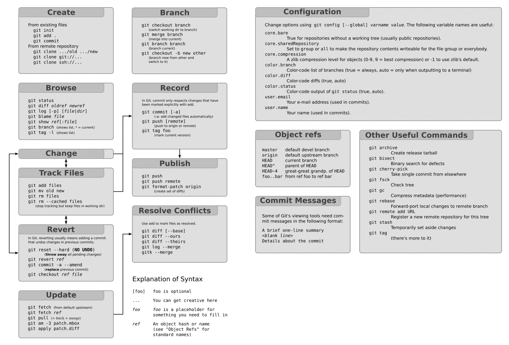

title:Pour aller plus loin
intro:nous permettra de parler des sujets dont on ne va pas parler.
conclusion:Découvert tout ce qu'il reste à découvrir à propos de git !

---

### Ce qu'on n'aborde pas

(… Mais qu'on peut faire avec git !)

- Modifier l'historique
- Mettre ses modifications de côté temporairement
- Récupérer des commits esseulés
- git mergetool
- Résoudre automatiquement des conflits déjà rencontrés
- Trouver un bug avec bisect

Plein d'autres choses, git est très puissant !
https://git.goffinet.org/

---

