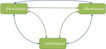
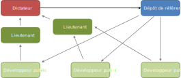
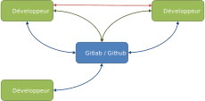

title:Concepts de git
intro:nous permettra de découvrir git.
conclusion:Vu les principes de base de git.

---

## Gestion de version à l'ancienne

- Copier-coller le code-source dans un répertoire : (Monprogramme-version2.good.new.final/)
- Outil historique : CVS (Le premier utilisé massivement !)
- Outils centralisés : SVN, ClearCase, Perforce
  - Un serveur stocke l'historique, les copies de travail ne contiennent qu'une version
  - Utilisation partielle sans réseau
- Outils dé-centralisés : **Git**, Mercurial, Darcs, Fossil
  - Chaque copie de travail comporte aussi l'historique
  - Mécanismes de synchro entre deux dépôts

---

## Gestion de version

La gestion de version a de nombreux avantages : 

- **Retours en arrière** et corrections toujours possibles
- **Historique** de toutes les opérations
- Indispensable pour le **travail en équipe**
- Travaux en **parallèle** sur **plusieurs branches**
- Pour du **code** mais aussi un **site web**, de la **doc**, de la **conf**, etc.

---

## Pourquoi indispensable ?

Le développement de logiciel est un processus itératif : 

- Il y a très souvent de **nouvelles versions** (corrections, ajouts)

L'historique des développements est important :

- Comprendre d'où provient un bug
- Identifier comment une modification a été faite
- **Tester** dans une version antérieure encore déployée chez un client

---

## Concept d'historique

- Chaque modification du code-source (**révision**) est enregistrée dans un «dépôt» local
- L'ensemble des **révisions** forme l'historique

---

## Un système distribué

---

## Un système distribué

---

## Un système distribué

---

## Concrètement

- Tout est géré dans un répertoire .git  à la base du projet 
- Un système de branches permet de gérer des versions en parallèle
- Il y a des solutions de centralisations (Gitlab, Github)
- A distance on est connecté via SSH ou HTTPS
- Utilisation de l'empreinte SHA-1 pour gérer l'intégrité