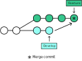
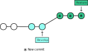
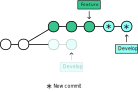
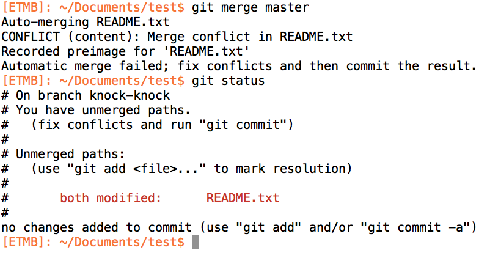
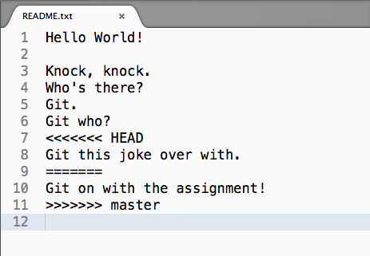

title:Merge Vs. Rebase
intro:nous présentera le mécanisme de merge et de rebase
conclusion:Compris la différence entre un merge et un rebase

---

## Situation initiale


---

## Merge




---

## Retour à la situation initiale


---

## Rebase




---

## Rebase Interactif


---

## Rebase **règle d'or** 

Ne jamais l'utiliser sur des branches publiques




---

### Merge : dans quel cas ?

- Pour avoir une branche identifiable dans le graphe
- Pour visualiser une branche « connue », identifiée par l'équipe, le bugtracker ou le gestionnaire de projet (sprint, story, bug…)
- Pour conserver la date de départ de la tâche

---

### Rebase : dans quel cas ?

- Pour avoir un graphe linéaire
- Dans le cas d'une branche locale temporaire partant d'une base obsolète
- Pour nettoyer mon historique local et le mettre au propre avant de le partager
- Quand la date de départ de la tâche n'a pas d'importance

---

Parfois, lorsque l'on merge des branches… Un conflit sauvage apparaît !




---

### Le diff



---

Résolution !

- Annuler un merge/rebase : 
```shell
git merge/rebase --abort
```

- Rechercher tous les fichiers qui contiennent le mot TODO dans le code source :
```shell
git grep "TODO"
```

- Voir qui sont les dernières personnes à avoir modifié les différentes lignes d'un fichier :
```shell
git blame myFile
```

---

- Voir l'historique d'un fichier :
```shell
git log –p myFile
```

- Voir les modifications sur un fichier entre deux commits :
```shell
git diff oldId newId
```

- Voir les détails d'un commit :
```shell
git show id
```

---

Pour minimiser les conflits :

- Faire des commits réguliers et de petite taille
- Éviter les branches qui vivent trop longtemps (voir si il est possible de répartir la fonctionnalité de cette branche en plusieurs sous fonctionnalités et donc en plusieurs branches dont la durée de vie sera moins importante)
- Régulièrement se remettre à jour avec la branche distante (avant chaque commit, avec git pull)
- Respecter un système de branche
- Utiliser les bons outils pour vous aider