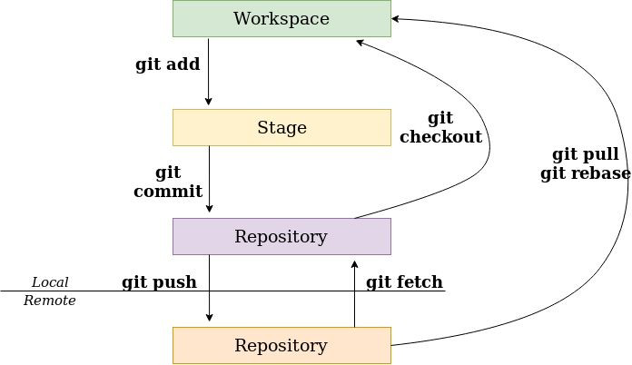
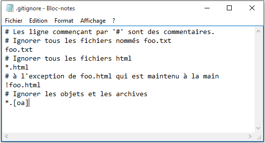

title:Les zones et les états
intro:nous présentera les zones de travail et les états des fichiers.
conclusion:Découvert le concept de zone et d'état de fichier.

---

## Les 3 zones

- **Working directory**
  - C'est ici qu'on travaille
  - On y modifie nos fichiers « normalement »
- **Index / stage**
  - Zone de « sauvegarde » des modifications qu'on souhaite partager
  - Les modifications y sont en attente.
- **Local repository**
  - C'est notre dépôt local, où se trouve la modification une fois qu'on a fait notre commit
  - C'est ce qui est prêt à être envoyé sur le serveur distant

---

## Changement de zone




---

## Manipulations basiques

- Initialiser un dépôt :
  - git init
- Récupérer (cloner) un dépôt :
  - git clone <url>
- Ajouter un dépôt distant :
  - git remote add <nomRepo> <url>
- Pousser votre version sur un dépôt :
  - git push <nomRepo> <nomBranch>
- Récupérer la dernière mise à jour d'un dépôt :
  - git fetch (+ git merge)
- Récupération des changements
  - git pull

---

## Etat des fichiers


---

## Où en suis-je ?

- Connaître l'état du répertoire
- Regarder les différences par rapport à l'index (la zone de staging)

```shell
git status

On branch master

Changes not staged for commit:
  (use "git add <file>..." to update what will be committed)
  (use "git checkout -- <file>..." to discard changes in working
directory)

    modified: views/add_commentaire.php

no changes added to commit (use "git add" and/or "git commit -a")
```

---

## En direction du commit

- Ajouter les modifications à l'index (zone de staging)

```shell
git add views/add_commentaire.php
git status

On branch master
Changes to be committed:
  (use "git restore --staged <file>..." to unstage)

    modified: views/add_commentaire.php
```

---

## Désindexer des fichiers (1/2)

- Bien lire la réponse à **git status**

```shell
git status

On branch master
Changes to be committed:
  (use "git restore --staged <file>..." to unstage)

    modified: views/add_commentaire.php
```

---

## Désindexer des fichiers (2/2)

- ... Et s'en servir

```shell
git restore --staged monfichier
git status

On branch master
Changes not staged for commit:
  (use "git add <file>..." to update what will be committed)
  (use "git checkout -- <file>..." to discard changes in
working directory)

    modified: views/add_commentaire.php

no changes added to commit (use "git add" and/or "git commit -a")
```

---

## Ignorer des fichiers

Pour que Git ignore des fichiers (binaires, fichiers de conf, etc.), il faut un fichier **.gitignore** à la racine du dépôt. Il doit contenir les chemins à ignorer (expressions régulières).



