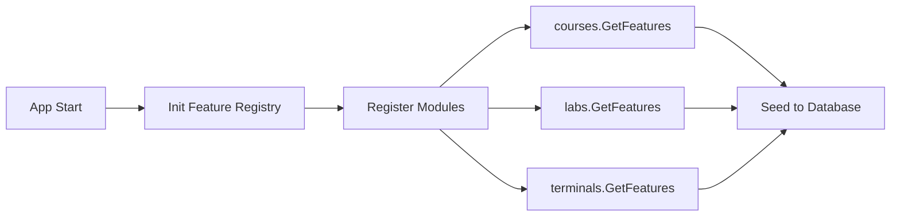
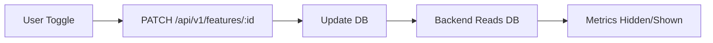

# Modular Feature System

## Overview

The feature flag system is now **fully modular**. Each module (courses, labs, terminals) declares its own features through a simple interface. When you modularize the application later, features will automatically come with each module.

## Architecture

### 1. Module Interface

Every module implements `ModuleConfig`:

```go
// src/configuration/interfaces/moduleInterface.go
type ModuleConfig interface {
    GetModuleName() string
    GetFeatures() []models.FeatureDefinition
}
```

### 2. Feature Definition

Modules define their features declaratively:

```go
type FeatureDefinition struct {
    Key         string  // Unique key (e.g., "course_conception")
    Name        string  // Display name
    Description string  // User-friendly description
    Enabled     bool    // Default enabled state
    Category    string  // e.g., "modules", "features"
    Module      string  // Owning module name
}
```

### 3. Feature Registry

`GlobalFeatureRegistry` collects features from all modules and seeds them into the database.

## How to Add a Module with Features

### Step 1: Create Module Config

```go
// src/mymodule/moduleConfig.go
package mymodule

import (
    configInterfaces "soli/formations/src/configuration/interfaces"
    "soli/formations/src/configuration/models"
)

type MyModuleConfig struct{}

func NewMyModuleConfig() configInterfaces.ModuleConfig {
    return &MyModuleConfig{}
}

func (m *MyModuleConfig) GetModuleName() string {
    return "mymodule"
}

func (m *MyModuleConfig) GetFeatures() []models.FeatureDefinition {
    return []models.FeatureDefinition{
        {
            Key:         "my_feature",
            Name:        "My Feature",
            Description: "Enable/disable my awesome feature",
            Enabled:     true,
            Category:    "modules",
            Module:      "mymodule",
        },
    }
}
```

### Step 2: Register Module in main.go

```go
// main.go:registerModuleFeatures()
modules := []interface {
    GetModuleName() string
    GetFeatures() []configModels.FeatureDefinition
}{
    courses.NewCoursesModuleConfig(),
    labs.NewLabsModuleConfig(),
    terminalTrainer.NewTerminalTrainerModuleConfig(),
    mymodule.NewMyModuleConfig(), // ← Add your module here
}
```

### Step 3: Done!

On next startup:
- ✅ Feature automatically registered
- ✅ Seeded into database
- ✅ Available via API (`GET /api/v1/features`)
- ✅ Toggleable in frontend

## Existing Modules

### Courses Module
**File**: `src/courses/moduleConfig.go`

**Features**:
- `course_conception` - Course generation with Marp/Slidev

**Usage in metrics**: Controls `courses_created` metric

### Labs Module
**File**: `src/labs/moduleConfig.go`

**Features**:
- `labs` - Lab environment and sessions

**Usage in metrics**: Controls `lab_sessions` metric

### Terminals Module
**File**: `src/terminalTrainer/moduleConfig.go`

**Features**:
- `terminals` - Terminal training sessions

**Usage in metrics**: Controls `concurrent_terminals` metric

## Feature Lifecycle

### 1. Application Startup



### 2. Feature Toggle (Frontend)



## Benefits of Modular System

### ✅ Easy to Add Modules
Just create a `moduleConfig.go` file and register it. No hardcoded constants!

### ✅ Self-Documenting
Each module declares what features it provides.

### ✅ Future-Proof
When you split into separate packages/plugins, each module carries its features.

### ✅ No Central Registry
No need to update a central list when adding modules.

### ✅ Database-Driven
Features stored in DB, changeable via UI without code changes.

## Example: Adding a "Quizzes" Module

**Step 1:** Create module structure
```bash
mkdir -p src/quizzes
```

**Step 2:** Create moduleConfig.go
```go
// src/quizzes/moduleConfig.go
package quizzes

func NewQuizzesModuleConfig() configInterfaces.ModuleConfig {
    return &QuizzesModuleConfig{}
}

func (q *QuizzesModuleConfig) GetModuleName() string {
    return "quizzes"
}

func (q *QuizzesModuleConfig) GetFeatures() []models.FeatureDefinition {
    return []models.FeatureDefinition{
        {
            Key:         "quizzes",
            Name:        "Interactive Quizzes",
            Description: "Enable quiz creation and student assessments",
            Enabled:     true,
            Category:    "modules",
            Module:      "quizzes",
        },
    }
}
```

**Step 3:** Register in main.go
```go
import "soli/formations/src/quizzes"

modules := []interface {
    GetModuleName() string
    GetFeatures() []configModels.FeatureDefinition
}{
    courses.NewCoursesModuleConfig(),
    labs.NewLabsModuleConfig(),
    terminalTrainer.NewTerminalTrainerModuleConfig(),
    quizzes.NewQuizzesModuleConfig(),
}
```

**Step 4:** Restart app
```bash
go run main.go
# Logs:
# 📋 Module 'quizzes' registered feature: quizzes (Interactive Quizzes)
# ✅ Created feature: quizzes (module: quizzes, enabled: true)
```

**Step 5:** Use in code
```go
featureRepo := configRepo.NewFeatureRepository(db)
if featureRepo.IsFeatureEnabled("quizzes") {
    // Show quiz UI
}
```

## API Response Example

```bash
GET /api/v1/features
```

```json
[
  {
    "id": "abc123",
    "key": "course_conception",
    "name": "Course Generation",
    "description": "Enable/disable course generation features",
    "enabled": true,
    "category": "modules",
    "module": "courses",
    "created_at": "2025-01-01T00:00:00Z",
    "updated_at": "2025-01-01T00:00:00Z"
  },
  {
    "id": "def456",
    "key": "labs",
    "name": "Lab Sessions",
    "description": "Enable/disable lab environment features",
    "enabled": true,
    "category": "modules",
    "module": "labs",
    "created_at": "2025-01-01T00:00:00Z",
    "updated_at": "2025-01-01T00:00:00Z"
  },
  {
    "id": "ghi789",
    "key": "terminals",
    "name": "Terminal Trainer",
    "description": "Enable/disable terminal training sessions",
    "enabled": false,
    "category": "modules",
    "module": "terminals",
    "created_at": "2025-01-01T00:00:00Z",
    "updated_at": "2025-01-01T00:00:00Z"
  }
]
```

## Frontend Integration

### Fetch Features by Module

```javascript
// Get all features
const features = await fetch('/api/v1/features').then(r => r.json())

// Group by module
const featuresByModule = features.reduce((acc, feature) => {
  if (!acc[feature.module]) acc[feature.module] = []
  acc[feature.module].push(feature)
  return acc
}, {})

// Display per module
Object.entries(featuresByModule).forEach(([module, features]) => {
  console.log(`Module: ${module}`)
  features.forEach(f => console.log(`  - ${f.name}: ${f.enabled}`))
})
```

### Toggle Feature

```javascript
async function toggleFeature(featureId, enabled) {
  await fetch(`/api/v1/features/${featureId}`, {
    method: 'PATCH',
    headers: { 'Content-Type': 'application/json' },
    body: JSON.stringify({ enabled })
  })

  // Sync metrics after toggle
  await fetch('/api/v1/user-subscriptions/sync-usage-limits', {
    method: 'POST'
  })
}
```

## Code Structure

```
src/
├── configuration/
│   ├── models/
│   │   └── feature.go              # Feature & FeatureDefinition models
│   ├── interfaces/
│   │   └── moduleInterface.go      # ModuleConfig interface
│   ├── services/
│   │   └── featureRegistryService.go  # GlobalFeatureRegistry
│   ├── repositories/
│   │   └── featureRepository.go    # Database access
│   ├── dto/
│   │   └── featureDto.go           # API DTOs
│   └── entityRegistration/
│       └── featureRegistration.go  # CRUD endpoints
├── courses/
│   └── moduleConfig.go             # Courses module features
├── labs/
│   └── moduleConfig.go             # Labs module features
└── terminalTrainer/
    └── moduleConfig.go             # Terminals module features
```

## Migration Path to Microservices

When you eventually split into separate services:

1. **Each service keeps its moduleConfig.go**
2. **Central service calls `/features` endpoint** on each microservice
3. **Aggregates features** from all services
4. **Frontend gets unified list** of all available features

No code changes needed in individual modules!

## Summary

✅ **Zero hardcoded constants**
✅ **Modules self-register features**
✅ **Database-driven toggles**
✅ **Frontend-controllable**
✅ **Ready for modularization**

When you split into separate modules/packages, each one brings its own features with zero central coordination!
